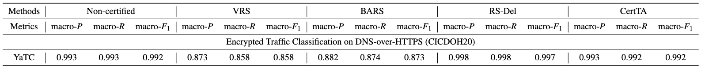
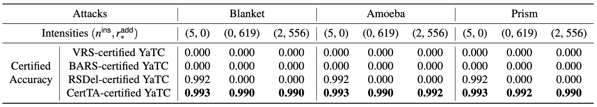
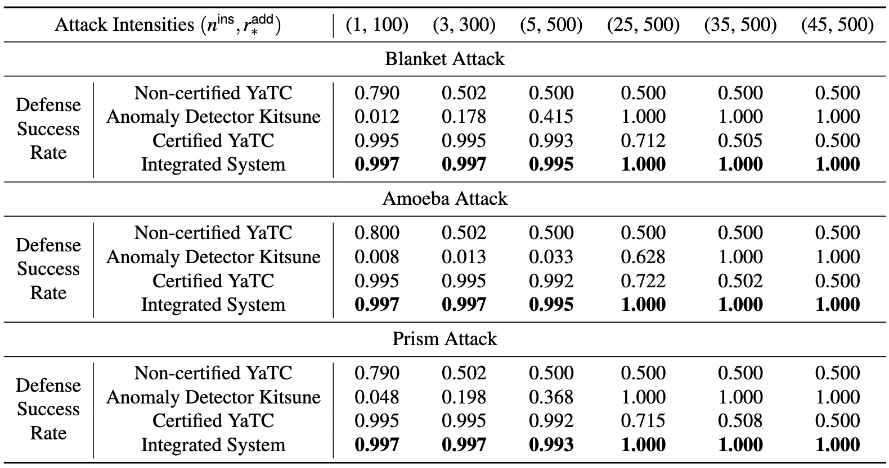

# Demo with the CICDOH20 dataset and the YaTC model

In this demo, we will use the CICDOH20 dataset and the pre-trained YaTC model to build CertTA-certified/baseline traffic analysis models and reproduce the key experiments in our paper based on these models. The intermediate model checkpoints and experimental results will be saved to enable easy comparisons with the results found in our paper.

## Reproduce Section 5.2: Certified Robustness against Adversarial Attacks

In the experiments of Section 5.2, we demonstrate that (i) CertTA provides much stronger robustness guarantees against multi-modal adversarial attacks than the SOTA approaches (i.e., VRS, BARS and RS-Del), and (ii) CertTA imposes very minimal performance reductions on clean traffic. 
 
Using the CICDOH20 dataset and the YaTC model, we reproduce the experimental results in Figure 6 and Table 5 to verify these claims.

### 1. Train Baseline/CertTA-certified Traffic Analysis models


```bash
python evaluation/train.py --dataset CICDOH20 --model YaTC # non-certified

python evaluation/train.py --dataset CICDOH20 --model YaTC --augment VRS # VRS-certified

python evaluation/train.py --dataset CICDOH20 --model YaTC --augment BARS # BARS-certified

python evaluation/train.py --dataset CICDOH20 --model YaTC --augment RSDel # RSDel-certified

python evaluation/train.py --dataset CICDOH20 --model YaTC --augment CertTA # CertTA-certified
```

The trained model checkpoints and training logs will be saved as follows:

```bash
└── 📁model
    └── 📁YaTC
        └── 📁save
            └── CICDOH20
                └── 📁YaTC # non-certified
                    └── best_model.bin
                    └── training_log.txt
                └── 📁YaTC_VRS_sigma_80 # VRS-certified
                    └── best_model.bin
                    └── training_log.txt
                └── 📁YaTC_BARS # BARS-certified
                    └── best_model.bin
                    └── training_log.txt
                └── 📁YaTC_RSDel_pr_del_0.9 # RSDel-certified
                    └── best_model.bin
                    └── training_log.txt
                └── 📁YaTC_CertTA_beta_length_200_beta_time_ms_40_pr_sel_0.1 # CertTA-certified
                    └── best_model.bin
                    └── training_log.txt
```

After each training epoch, the F1-score and loss on the training set and validation set will be saved in `training_log.txt`. For example:

```bash
cat model/YaTC/save/CICDOH20/YaTC_CertTA_beta_length_200_beta_time_ms_40_pr_sel_0.1/training_log.txt

# ...
# Epoch 7, train f1 0.9394562002663472, valid f1 0.9293579386542774, best valid f1 0.9293579386542774, train loss 32.86972817778587, valid loss 4.418535083532333.
# Epoch 8, train f1 0.9563565482889869, valid f1 0.9596770098014322, best valid f1 0.9596770098014322, train loss 30.69086980819702, valid loss 4.221270561218262.
# Epoch 9, train f1 0.976319250731055, valid f1 0.9675514013068586, best valid f1 0.9675514013068586, train loss 28.67674347758293, valid loss 3.9662385880947113.
# ...
```

> To save time, you can use these pre-saved model checkpoints to proceed with subsequent evaluations. Of course, you can also choose to train these models by yourself.

### 2. Evaluate the Performance on Clean Traffic

```bash
python evaluation/test.py --dataset CICDOH20 --model YaTC # non-certified

python evaluation/test.py --dataset CICDOH20 --model YaTC --augment VRS --smoothed VRS # VRS-certified

python evaluation/test.py --dataset CICDOH20 --model YaTC --augment BARS --smoothed BARS # BARS-certified

python evaluation/train.py --dataset CICDOH20 --model YaTC --augment RSDel --smoothed RSDel # RSDel-certified

python evaluation/test.py --dataset CICDOH20 --model YaTC --augment CertTA --smoothed CertTA # CertTA-certified
```

The classification results of test flows will be saved in json files as follows:

```bash
└── 📁model
    └── 📁YaTC
        └── 📁save
            └── CICDOH20
                └── 📁YaTC # non-certified
                    └── 📁base
                        └── 📁clean
                            └── 0th.json
                            └── 1th.json
                            └── ...
                └── 📁YaTC_CertTA_beta_length_200_beta_time_ms_40_pr_sel_0.1 # CertTA-certified
                    └── 📁CertTA
                        └── 📁clean
                            └── 0th.json
                            └── 1th.json
                            └── ...
                └──  ...
```

For test each flow, a dictionary instance will be saved to record the information required for accuracy meassurement and robustness region derivation, such as the original flow label, the predicted class and the corresponding probability, etc. For example:

```bash
cat model/YaTC/save/CICDOH20/YaTC_CertTA_beta_length_200_beta_time_ms_40_pr_sel_0.1/CertTA/clean/0th.json

# [
#     {
#         "label": 0, # the original flow label
#         "c_A": 0, # the predicted class
#         "p_A": 1.0, # the corresponding probability of the predicted class
#         "packet_num": 54, # the number of packets in the flow
#         "input_vector": "None", # for robustness region derivation in VRS/BARS-certified models
#         "source_file": "./dataset/CICDOH20/pcap/Benign/dump_00002_20200113111300/TCP_23-15-4-9_443_192-168-20-191_49365/1578944388.pcap" # the path of the original PCAP file
#     },
#     ...
# ]
```

Collect the classification results saved by `test.py` to calculate the accuracy/precision/recall/f1-score of each traffic class and their macro aggregation:

```bash
python evaluation/collect_classification_results.py --dataset CICDOH20 --model YaTC # non-certified

python evaluation/collect_classification_results.py --dataset CICDOH20 --model YaTC --augment VRS --smoothed VRS # VRS-certified

python evaluation/collect_classification_results.py --dataset CICDOH20 --model YaTC --augment BARS --smoothed BARS # BARS-certified

python evaluation/collect_classification_results.py --dataset CICDOH20 --model YaTC --augment RSDel --smoothed RSDel # RSDel-certified

python evaluation/collect_classification_results.py --dataset CICDOH20 --model YaTC --augment CertTA --smoothed CertTA # CertTA-certified
```

The calculated evaluation metrics will be saved as follows:

```bash
└── 📁model
    └── 📁YaTC
        └── 📁save
            └── CICDOH20
                └── 📁YaTC # non-certified
                    └── 📁base
                        └── 📁clean
                            └── empirical_acc.txt
                └── 📁YaTC_CertTA_beta_length_200_beta_time_ms_40_pr_sel_0.1 # CertTA-certified
                    └── 📁CertTA
                        └── 📁clean
                            └── empirical_acc.txt
                └──  ...
```

For example:

```bash
cat model/YaTC/save/CICDOH20/YaTC_CertTA_beta_length_200_beta_time_ms_40_pr_sel_0.1/CertTA/clean/empirical_acc.txt

# | Empirical Accuracy  0.995, Macro  0.992
# | Macro| precision  0.993| recall  0.992| f1  0.992

# | true label    0 | samples num    300 | accuracy  1.000 | precision  1.000 | recall  1.000 | f1  1.000 |    300      0      0      0 |
# | true label    1 | samples num    100 | accuracy  1.000 | precision  1.000 | recall  1.000 | f1  1.000 |      0    100      0      0 |
# | true label    2 | samples num    100 | accuracy  1.000 | precision  0.971 | recall  1.000 | f1  0.985 |      0      0    100      0 |
# | true label    3 | samples num    100 | accuracy  0.970 | precision  1.000 | recall  0.970 | f1  0.985 |      0      0      3     97 |
# | Average Accuracy  0.995 |
```

The reproduced results on clean traffic are summarized as follows, which can be compared with the results in Table 5 of our paper.



### 3. Meassure the Robustness Region of CertTA-certified Model

Based on the multi-modal robustness region derivation in Theorem 1 of our paper, we can collect the classification results saved by `test.py` to plot the certified accuracy curves under different attack intensities:

```bash
python evaluation/plot_certifiedacc_cdf.py --dataset CICDOH20 --model YaTC --augment CertTA --smoothed CertTA # CertTA-certified
```

The plotted figure will be saved as follows, which can be compared with the sub-figure on the leftmost column of Figure 6 in our paper.

```bash
└── 📁model
    └── 📁YaTC
        └── 📁save
            └── CICDOH20
                └── 📁YaTC_CertTA_beta_length_200_beta_time_ms_40_pr_sel_0.1 # CertTA-certified
                    └── 📁CertTA
                        └── 📁clean
                            └── certifiedacc_cdf.jpg
                            └── attack_intensities_at_certifiedacc
```


In the `attack_intensities_at_certifiedacc` file, we quantify the attack intensities $(n^{\textsf{ins}}, r^{\textsf{add}}_*)$ that are strong enough to degrade CertTA's certified accuracy to a pre-defined lower bound threshold $T_{\textsf{lower}}$. When $T_{\textsf{lower}} = 0.99$, we select three attack intensities $(5, 0), (0, 619), (2, 556)$ to generate adversarial flows and evaluate baseline certification methods against these flows.

### 4. Generate Adversarial Flows

Take the Blanket attack as an example, we train the attack model to generate adversarial flows of specific attack intensities:

```bash
# packet insertion only
python attack/Blanket/train.py --dataset CICDOH20 --attack_beta_length 200 --attack_beta_time_ms 40 --attack_pr_sel 0.1 --attack_r_additive_star 0 --attack_insert_pkts 5

python attack/Blanket/generate_attack_actions.py --dataset CICDOH20 --attack_beta_length 200 --attack_beta_time_ms 40 --attack_pr_sel 0.1 --attack_r_additive_star 0 --attack_insert_pkts 5

# additive perturbation only
python attack/Blanket/train.py --dataset CICDOH20 --attack_beta_length 200 --attack_beta_time_ms 40 --attack_pr_sel 0.1 --attack_r_additive_star 619 --attack_insert_pkts 0

python attack/Blanket/generate_attack_actions.py --dataset CICDOH20 --attack_beta_length 200 --attack_beta_time_ms 40 --attack_pr_sel 0.1 --attack_r_additive_star 619 --attack_insert_pkts 0

# packet insertion & additive perturbation
python attack/Blanket/train.py --dataset CICDOH20 --attack_beta_length 200 --attack_beta_time_ms 40 --attack_pr_sel 0.1 --attack_r_additive_star 556 --attack_insert_pkts 2 

python attack/Blanket/generate_attack_actions.py --dataset CICDOH20 --attack_beta_length 200 --attack_beta_time_ms 40 --attack_pr_sel 0.1 --attack_r_additive_star 556 --attack_insert_pkts 2 
```

The trained model checkpoints, training logs and generated adversarial perturbations will be saved as follows:

```bash
└── 📁attack
    └── 📁Blanket
        └── CICDOH20
            └── 📁Blanket_beta_length_200_beta_time_ms_40_pr_sel_0.1_r_additive_star_0.0_insert_pkts_5 # packet insertion only
                └── add_noiser.bin
                └── insert_noiser.bin
                └── training_log.txt
                └── attack.json
            └── 📁Blanket_beta_length_200_beta_time_ms_40_pr_sel_0.1_r_additive_star_619.0_insert_pkts_0 # additive perturbation only
                └── add_noiser.bin
                └── insert_noiser.bin
                └── training_log.txt
                └── attack.json
            └── 📁Blanket_beta_length_200_beta_time_ms_40_pr_sel_0.1_r_additive_star_556.0_insert_pkts_2 # packet insertion & additive perturbation
                └── add_noiser.bin
                └── insert_noiser.bin
                └── training_log.txt
                └── attack.json
```

> To save time, we pre-saved the adversarial perturbations genereted using the Blanket, Amoeba and Prism attacks for subsequent evaluations. You can also train these attack models to generate adversarial perturabtions by yourself. See [attack/README.md](https://github.com/InspiringGroup-Lab/CertTA/tree/main/attack#readme) for step-by-step instructions of running these attacks.

### 5. Evaluate the Certfied Accuacy agasint Adversarial Flows

Take the evaluation of the CertTA-certified model as an example:

```bash
python evaluation/test.py --dataset CICDOH20 --model YaTC --augment CertTA --smoothed CertTA --attack Blanket --attack_beta_length 200 --attack_beta_time_ms 40 --attack_pr_sel 0.1 --attack_r_additive_star 0 --attack_insert_pkts 5 # packet insertion only

python evaluation/test.py --dataset CICDOH20 --model YaTC --augment CertTA --smoothed CertTA --attack Blanket --attack_beta_length 200 --attack_beta_time_ms 40 --attack_pr_sel 0.1 --attack_r_additive_star 619 --attack_insert_pkts 0 # additive perturbation only

python evaluation/test.py --dataset CICDOH20 --model YaTC --augment CertTA --smoothed CertTA --attack Blanket --attack_beta_length 200 --attack_beta_time_ms 40 --attack_pr_sel 0.1 --attack_r_additive_star 556 --attack_insert_pkts 2 # packet insertion & additive perturbation
```

The classification results of adversarial flows will be saved in json files as follows:

```bash
└── 📁model
    └── 📁YaTC
        └── 📁save
            └── CICDOH20
                └── 📁YaTC_CertTA_beta_length_200_beta_time_ms_40_pr_sel_0.1 # CertTA-certified
                    └── 📁CertTA
                        └── 📁Blanket
                            └── 📁Blanket_beta_length_200_beta_time_ms_40_pr_sel_0.1_r_additive_star_0.0_insert_pkts_5 # packet insertion only
                                └── 0th.json
                                └── 1th.json
                                └── ...
                            └── 📁Blanket_beta_length_200_beta_time_ms_40_pr_sel_0.1_r_additive_star_619.0_insert_pkts_0 # additive perturbation only
                                └── 0th.json
                                └── 1th.json
                                └── ...
                            └── 📁Blanket_beta_length_200_beta_time_ms_40_pr_sel_0.1_r_additive_star_556.0_insert_pkts_2 # packet insertion & additive perturbation
                                └── 0th.json
                                └── 1th.json
                                └── ...
```

Based on the classification results of the clean flows without adversarial perturbations, we can derive the robustness region to meassure the certified accuracy against adversarial flows:

```bash
python evaluation/collect_classificaiton_results.py --dataset CICDOH20 --model YaTC --augment CertTA --smoothed CertTA --attack Blanket --attack_beta_length 200 --attack_beta_time_ms 40 --attack_pr_sel 0.1 --attack_r_additive_star 0 --attack_insert_pkts 5 # packet insertion only

python evaluation/collect_classificaiton_results.py --dataset CICDOH20 --model YaTC --augment CertTA --smoothed CertTA --attack Blanket --attack_beta_length 200 --attack_beta_time_ms 40 --attack_pr_sel 0.1 --attack_r_additive_star 619 --attack_insert_pkts 0 # additive perturbation only

python evaluation/collect_classificaiton_results.py --dataset CICDOH20 --model YaTC --augment CertTA --smoothed CertTA --attack Blanket --attack_beta_length 200 --attack_beta_time_ms 40 --attack_pr_sel 0.1 --attack_r_additive_star 556 --attack_insert_pkts 2 # packet insertion & additive perturbation
```

The certified accuracy of each traffic class and their macro aggregation will be saved as follows:

```bash
└── 📁model
    └── 📁YaTC
        └── 📁save
            └── CICDOH20
                └── 📁YaTC_CertTA_beta_length_200_beta_time_ms_40_pr_sel_0.1 # CertTA-certified
                    └── 📁CertTA
                        └── 📁Blanket
                            └── 📁Blanket_beta_length_200_beta_time_ms_40_pr_sel_0.1_r_additive_star_0.0_insert_pkts_5 # packet insertion only
                                └── certified_acc.txt
                            └── 📁Blanket_beta_length_200_beta_time_ms_40_pr_sel_0.1_r_additive_star_619.0_insert_pkts_0 # additive perturbation only
                                └── certified_acc.txt
                            └── 📁Blanket_beta_length_200_beta_time_ms_40_pr_sel_0.1_r_additive_star_556.0_insert_pkts_2 # packet insertion & additive perturbation
                                └── certified_acc.txt
```

For example:

```bash
cat model/YaTC/save/CICDOH20/YaTC_CertTA_beta_length_200_beta_time_ms_40_pr_sel_0.1/CertTA/Blanket/Blanket_beta_length_200_beta_time_ms_40_pr_sel_0.1_r_additive_star_556.0_insert_pkts_2/certified_acc.txt

# | Certified Accuracy  0.990, Macro  0.987 |

# | true label    0 | samples num    300 | certified accuracy  0.997 |
# | true label    1 | samples num    100 | certified accuracy  0.990 |
# | true label    2 | samples num    100 | certified accuracy  0.990 |
# | true label    3 | samples num    100 | certified accuracy  0.970 |
```

The experimental results of VRS/BARS/RSDel-certified models can be obtained by replace `--augment` and `--smoothed` with VRS/BARS/RSDel, respectively. The reproduced results on adversarial flows are summarized as follows, which can be compared with the results in the right-side three columns of Figure 6.




## Reproduce Section 5.3: Integration with Anomaly Detection

In the experiments of Section 5.3, we demonstrate  a synergistic integration between CertTA and anomaly detection systems that achieves consistently
high Defense Success Rate against adversarial attacks with varying attack intensities. 
 
Using the CICDOH20 dataset and the YaTC model, we reproduce the experimental results in Figure 8 to verify this claim.

### 1. Generate Adversarial Flows of Different Intensities

We use the Blanket, Amoeba and Prism attacks to generate adversarial flows with 6 attack intensities $(n^{\textsf{ins}}, r^{\textsf{add}}_*)$: $(1, 100), (3, 300), (5, 500), (25, 500), (35, 500), (45, 500)$.

For example, we train the Blanket attack model to generate adversarial flows of attack intensities $(5, 500)$ as follows:

```bash
python attack/Blanket/train.py --dataset CICDOH20 --attack_beta_length 200 --attack_beta_time_ms 40 --attack_pr_sel 0.1 --attack_r_additive_star 500 --attack_insert_pkts 5

python attack/Blanket/generate_attack_actions.py --dataset CICDOH20 --attack_beta_length 200 --attack_beta_time_ms 40 --attack_pr_sel 0.1 --attack_r_additive_star 500 --attack_insert_pkts 5
```

The trained model checkpoint, training log and generated adversarial perturbations will be saved as follows:

```bash
└── 📁attack
    └── 📁Blanket
        └── CICDOH20
            └── 📁Blanket_beta_length_200_beta_time_ms_40_pr_sel_0.1_r_additive_star_500.0_insert_pkts_5
                └── add_noiser.bin
                └── insert_noiser.bin
                └── training_log.txt
                └── attack.json
```

> To save time, we pre-saved the adversarial perturbations genereted using the Blanket, Amoeba and Prism attacks for subsequent evaluations. You can also train these attack models to generate adversarial perturabtions by yourself. See [attack/README.md](https://github.com/InspiringGroup-Lab/CertTA/tree/main/attack#readme) for step-by-step instructions of running these attacks.

### 2. Evaluate Non-certified Model against Adversarial Flows

For example, we evaluate the non-certified YaTC model against the adversarial flows generated by Blanket with attack intensities $(5, 500)$ as follows:

```bash
python evaluation/test.py --dataset CICDOH20 --model YaTC --attack Blanket --attack_beta_length 200 --attack_beta_time_ms 40 --attack_pr_sel 0.1 --attack_r_additive_star 500 --attack_insert_pkts 5

python evaluation/collect_classification_results.py --dataset CICDOH20 --model YaTC --attack Blanket --attack_beta_length 200 --attack_beta_time_ms 40 --attack_pr_sel 0.1 --attack_r_additive_star 500 --attack_insert_pkts 5
```

The accuracy/precision/recall/f1-score of each traffic class and their macro aggregation will be saved as follows:

```bash
└── 📁model
    └── 📁YaTC
        └── 📁save
            └── CICDOH20
                └── 📁YaTC # non-certified
                    └── 📁base
                        └── 📁Blanket
                            └── 📁Blanket_beta_length_200_beta_time_ms_40_pr_sel_0.1_r_additive_star_500.0_insert_pkts_5
                                └── empirical_acc.txt
```

```bash
cat model/YaTC/save/CICDOH20/YaTC/base/Blanket/Blanket_beta_length_200_beta_time_ms_40_pr_sel_0.1_r_additive_star_500.0_insert_pkts_5/empirical_acc.txt

# | Empirical Accuracy  0.500, Macro  0.250
# | Macro| precision  0.125| recall  0.250| f1  0.167

# | true label    0 | samples num    300 | accuracy  1.000 | precision  0.500 | recall  1.000 | f1  0.667 |    300      0      0      0 |
# | true label    1 | samples num    100 | accuracy  0.000 | precision  0.000 | recall  0.000 | f1  0.000 |    100      0      0      0 |
# | true label    2 | samples num    100 | accuracy  0.000 | precision  0.000 | recall  0.000 | f1  0.000 |    100      0      0      0 |
# | true label    3 | samples num    100 | accuracy  0.000 | precision  0.000 | recall  0.000 | f1  0.000 |    100      0      0      0 |
# | Average Accuracy  0.500 |
```

### 3. Train Anomaly Detector Kitsune

```bash
python integration/train_anomaly_detector.py --dataset CICDOH20 --model Kitsune
```
The trained model checkpoint and training log will be saved as follows:

```bash
└── 📁model
    └── 📁Kitsune
        └── 📁save
            └── CICDOH20
                └── 📁Kitsune_AD
                    └── best_model.bin
                    └── norm_max.npy # for input normalization
                    └── norm_min.npy # for input normalization
                    └── training_log.txt
```

### 4. Evaluate Standalone Anomaly Detector against Adversarial Flows

For example, we evaluate the standalone anomaly detector Kitsune against the adversarial flows generated by Blanket with attack intensities $(5, 500)$ as follows:

```bash
python integration/test_anomaly_detector.py --dataset CICDOH20 --model Kitsune --attack Blanket --attack_beta_length 200 --attack_beta_time_ms 40 --attack_pr_sel 0.1 --attack_r_additive_star 500 --attack_insert_pkts 5 --FPR_threshold 0.01
```

The False Positive Rate on clean traffic and the True Positive Rate on adversarial flows will be saved as follows:

```bash
└── 📁model
    └── 📁Kitsune
        └── 📁save
            └── CICDOH20
                └── 📁Kitsune_AD # Anomaly Detector
                    └── 📁Blanket
                        └── 📁Blanket_beta_length_200_beta_time_ms_40_pr_sel_0.1_r_additive_star_500.0_insert_pkts_5
                            └── anomaly_detection_acc.txt
```

```bash
cat model/Kitsune/save/CICDOH20/Kitsune_AD/Blanket/Blanket_beta_length_200_beta_time_ms_40_pr_sel_0.1_r_additive_star_500.0_insert_pkts_5/anomaly_detection_acc.txt

# | FPR  0.010, PR  0.415
```

### 5. Evaluate Standalone Certified Model against Adversarial Flows

For example, we evaluate the CertTA-certified YaTC model against the adversarial flows generated by Blanket with attack intensities $(5, 500)$ as follows:

```bash
python evaluation/test.py --dataset CICDOH20 --model YaTC --augment CertTA --smoothed CertTA --attack Blanket --attack_beta_length 200 --attack_beta_time_ms 40 --attack_pr_sel 0.1 --attack_r_additive_star 500 --attack_insert_pkts 5

python evaluation/collect_classificaiton_results.py --dataset CICDOH20 --model YaTC --augment CertTA --smoothed CertTA --attack Blanket --attack_beta_length 200 --attack_beta_time_ms 40 --attack_pr_sel 0.1 --attack_r_additive_star 500 --attack_insert_pkts 5
```

The accuracy/precision/recall/f1-score of each traffic class and their macro aggregation will be saved as follows:

```bash
└── 📁model
    └── 📁YaTC
        └── 📁save
            └── CICDOH20
                └── 📁YaTC_CertTA_beta_length_200_beta_time_ms_40_pr_sel_0.1 # CertTA-certified
                    └── 📁CertTA
                        └── 📁Blanket
                            └── 📁Blanket_beta_length_200_beta_time_ms_40_pr_sel_0.1_r_additive_star_500.0_insert_pkts_5
                                └── empirical_acc.txt
```

```bash
cat model/YaTC/save/CICDOH20/YaTC_CertTA_beta_length_200_beta_time_ms_40_pr_sel_0.1/CertTA/Blanket/Blanket_beta_length_200_beta_time_ms_40_pr_sel_0.1_r_additive_star_500.0_insert_pkts_5/empirical_acc.txt

# | Empirical Accuracy  0.993, Macro  0.990
# | Macro| precision  0.992| recall  0.990| f1  0.991

# | true label    0 | samples num    300 | accuracy  1.000 | precision  0.997 | recall  1.000 | f1  0.998 |    300      0      0      0 |
# | true label    1 | samples num    100 | accuracy  0.990 | precision  1.000 | recall  0.990 | f1  0.995 |      1     99      0      0 |
# | true label    2 | samples num    100 | accuracy  1.000 | precision  0.971 | recall  1.000 | f1  0.985 |      0      0    100      0 |
# | true label    3 | samples num    100 | accuracy  0.970 | precision  1.000 | recall  0.970 | f1  0.985 |      0      0      3     97 |
# | Average Accuracy  0.993 |
```

### 6. Evaluate Integrated System against Adversarial Flows

For example, we evaluate the integrated system (Kitsune + CertTA-certified YaTC) against the adversarial flows generated by Blanket with attack intensities $(5, 500)$ as follows:

```bash
python integration/test_integrated_system.py --dataset CICDOH20 --model_AD Kitsune --model YaTC --augment CertTA --smoothed CertTA --attack Blanket --attack_beta_length 200 --attack_beta_time_ms 40 --attack_pr_sel 0.1 --attack_r_additive_star 500 --attack_insert_pkts 5 --FPR_threshold 0.01

python integration/collect_classification_results.py --dataset CICDOH20 --model_AD Kitsune --model YaTC --augment CertTA --smoothed CertTA --attack Blanket --attack_beta_length 200 --attack_beta_time_ms 40 --attack_pr_sel 0.1 --attack_r_additive_star 500 --attack_insert_pkts 5 --FPR_threshold 0.01
```

The Defense Success Rate on adversarial flows will be saved as follows:

```bash
└── 📁model
    └── 📁YaTC
        └── 📁save
            └── CICDOH20
                └── 📁YaTC_CertTA_beta_length_200_beta_time_ms_40_pr_sel_0.1 # CertTA-certified
                    └── 📁CertTA_with_AD
                        └── 📁Blanket
                            └── 📁Blanket_beta_length_200_beta_time_ms_40_pr_sel_0.1_r_additive_star_500.0_insert_pkts_5
                                └── defense_success_rate.txt
```

```bash
cat model/YaTC/save/CICDOH20/YaTC_CertTA_beta_length_200_beta_time_ms_40_pr_sel_0.1/CertTA_with_AD/Blanket/Blanket_beta_length_200_beta_time_ms_40_pr_sel_0.1_r_additive_star_500.0_insert_pkts_5/defense_success_rate.txt

# | Defense Success Rate  0.995, Macro  0.993
# | true label    0 | samples num    300 | success rate  1.000 | fail rate  0.000 |
# | true label    1 | samples num    100 | success rate  0.990 | fail rate  0.010 |
# | true label    2 | samples num    100 | success rate  1.000 | fail rate  0.000 |
# | true label    3 | samples num    100 | success rate  0.980 | fail rate  0.020 |
```

### 6. Summarized Results

The reproduced results on adversarial flows are summarized as follows, which can be compared with the results in Figure 8 of our paper.



## Reproduce Section 5.4: Deep Dive

In the experiments of Section 5.4, we evaluate the moving pieces in CertTA’s design and application cases of CertTA. The key experiments center around the certification delay and CertTA's performance under truncated settings.
 
### 1. Certification Delay

Using the CICDOH20 dataset and the YaTC model, the experimental results of certification delay (Table 6) can be reproduced as follows:

```bash
python evaluation/meassure_delay.py --dataset CICDOH20 --model YaTC --augment VRS --smoothed VRS # VRS-certified
# | Average Certification Delay 0.533s |

python evaluation/meassure_delay.py --dataset CICDOH20 --model YaTC --augment BARS --smoothed BARS # BARS-certified
# | Average Certification Delay 0.537s |

python evaluation/meassure_delay.py --dataset CICDOH20 --model YaTC --augment RSDel --smoothed RSDel # RSDel-certified
# | Average Certification Delay 0.708s |

python evaluation/meassure_delay.py --dataset CICDOH20 --model YaTC --augment CertTA --smoothed CertTA # CertTA-certified
# | Average Certification Delay 0.733s |
```

> **The reproduced results of certification delay can be significantly influenced by software and hardware configurations.** 
> 
> We implement CertTA with PyTorch under Python 3. The ``pathos.multiprocessing'' Python library is utilized to generate multiple smoothing samples in parallel for acceleration. Experiments are conducted on a Supermicro SYS-740GP-TNRT server with two Intel(R) Xeon(R) Gold 6348 CPUs (2 $\times$ 28 cores), 512GB RAM, one NVIDIA A100 GPU and two NVIDIA GeForce RTX 4090 GPUs.

 ### 2. Performance under Truncated Settings

 Using the CICDOH20 dataset and the YaTC model, the experimental results in Table 7 and Figure 9 can be reproduced as follows.

Train CertTA-ceritified models under truncated settings:

```bash
python evaluation/train.py --dataset CICDOH20 --model YaTC --augment CertTA --truncate 0.25

python evaluation/train.py --dataset CICDOH20 --model YaTC --augment CertTA --truncate 0.5

python evaluation/train.py --dataset CICDOH20 --model YaTC --augment CertTA --truncate 0.75
```

The trained model checkpoints and training logs will be saved as follows:

```bash
└── 📁model
    └── 📁YaTC
        └── 📁save
            └── CICDOH20
                └──📁YaTC_CertTA_beta_length_200_beta_time_ms_40_pr_sel_0.1_truncate_0.25
                    └── best_model.bin
                    └── training_log.txt
                └──📁YaTC_CertTA_beta_length_200_beta_time_ms_40_pr_sel_0.1_truncate_0.5
                    └── best_model.bin
                    └── training_log.txt
                └──📁YaTC_CertTA_beta_length_200_beta_time_ms_40_pr_sel_0.1_truncate_0.75
                    └── best_model.bin
                    └── training_log.txt
```

Evaluate truncated models on clean traffic:

```bash
# Truncated Setting: 0.25
python evaluation/test.py --dataset CICDOH20 --model YaTC --augment CertTA --smoothed CertTA --truncate 0.25

python evaluation/collect_classificaiton_results.py --dataset CICDOH20 --model YaTC --augment CertTA --smoothed CertTA --truncate 0.25

# Truncated Setting: 0.5
python evaluation/test.py --dataset CICDOH20 --model YaTC --augment CertTA --smoothed CertTA --truncate 0.5

python evaluation/collect_classificaiton_results.py --dataset CICDOH20 --model YaTC --augment CertTA --smoothed CertTA --truncate 0.5

# Truncated Setting: 0.75
python evaluation/test.py --dataset CICDOH20 --model YaTC --augment CertTA --smoothed CertTA --truncate 0.75

python evaluation/collect_classificaiton_results.py --dataset CICDOH20 --model YaTC --augment CertTA --smoothed CertTA --truncate 0.75
```

The reproduced results will be saved as follows, which can be compared with the results in Table 7:

```bash
└── 📁model
    └── 📁YaTC
        └── 📁save
            └── CICDOH20
                └──📁YaTC_CertTA_beta_length_200_beta_time_ms_40_pr_sel_0.1_truncate_0.25
                    └──CertTA
                        └── clean
                            └── empirical_acc.txt
                └──📁YaTC_CertTA_beta_length_200_beta_time_ms_40_pr_sel_0.1_truncate_0.5
                    └──CertTA
                        └── clean
                            └── empirical_acc.txt
                └──📁YaTC_CertTA_beta_length_200_beta_time_ms_40_pr_sel_0.1_truncate_0.75
                    └──CertTA
                        └── clean
                            └── empirical_acc.txt
```

```bash
cat model/YaTC/save/CICDOH20/YaTC_CertTA_beta_length_200_beta_time_ms_40_pr_sel_0.1_truncate_0.25/CertTA/clean/empirical_acc.txt

# | Empirical Accuracy  1.000, Macro  1.000
# | Macro| precision  1.000| recall  1.000| f1  1.000

# | true label    0 | samples num    300 | accuracy  1.000 | precision  1.000 | recall  1.000 | f1  1.000 |    300      0      0      0 |
# | true label    1 | samples num    100 | accuracy  1.000 | precision  1.000 | recall  1.000 | f1  1.000 |      0    100      0      0 |
# | true label    2 | samples num    100 | accuracy  1.000 | precision  1.000 | recall  1.000 | f1  1.000 |      0      0    100      0 |
# | true label    3 | samples num    100 | accuracy  1.000 | precision  1.000 | recall  1.000 | f1  1.000 |      0      0      0    100 |
# | Average Accuracy  1.000 |

cat model/YaTC/save/CICDOH20/YaTC_CertTA_beta_length_200_beta_time_ms_40_pr_sel_0.1_truncate_0.5/CertTA/clean/empirical_acc.txt

# | Empirical Accuracy  1.000, Macro  1.000
# | Macro| precision  1.000| recall  1.000| f1  1.000

# | true label    0 | samples num    300 | accuracy  1.000 | precision  1.000 | recall  1.000 | f1  1.000 |    300      0      0      0 |
# | true label    1 | samples num    100 | accuracy  1.000 | precision  1.000 | recall  1.000 | f1  1.000 |      0    100      0      0 |
# | true label    2 | samples num    100 | accuracy  1.000 | precision  1.000 | recall  1.000 | f1  1.000 |      0      0    100      0 |
# | true label    3 | samples num    100 | accuracy  1.000 | precision  1.000 | recall  1.000 | f1  1.000 |      0      0      0    100 |
# | Average Accuracy  1.000 |

cat model/YaTC/save/CICDOH20/YaTC_CertTA_beta_length_200_beta_time_ms_40_pr_sel_0.1_truncate_0.75/CertTA/clean/empirical_acc.txt

# ...
```

Collect the classification results saved by `test.py` to plot the certified accuracy curves under different attack intensities:

```bash
python evaluation/plot_certifiedacc_cdf.py --dataset CICDOH20 --model YaTC --augment CertTA --smoothed CertTA --truncate 0.25

python evaluation/plot_certifiedacc_cdf.py --dataset CICDOH20 --model YaTC --augment CertTA --smoothed CertTA --truncate 0.5

python evaluation/plot_certifiedacc_cdf.py --dataset CICDOH20 --model YaTC --augment CertTA --smoothed CertTA --truncate 0.75
```

The plotted figure will be saved as follows, which can be compared with the results in Figure 9:

```bash
└── 📁model
    └── 📁YaTC
        └── 📁save
            └── CICDOH20
                └──📁YaTC_CertTA_beta_length_200_beta_time_ms_40_pr_sel_0.1_truncate_0.25
                    └──CertTA
                        └── clean
                            └── certifiedacc_cdf.jpg
                └──📁YaTC_CertTA_beta_length_200_beta_time_ms_40_pr_sel_0.1_truncate_0.5
                    └──CertTA
                        └── clean
                            └── certifiedacc_cdf.jpg
                └──📁YaTC_CertTA_beta_length_200_beta_time_ms_40_pr_sel_0.1_truncate_0.75
                    └──CertTA
                        └── clean
                            └── certifiedacc_cdf.jpg
```

* Truncated setting 0.25

    

* Truncated setting 0.5

    

* Truncated setting 0.75

    